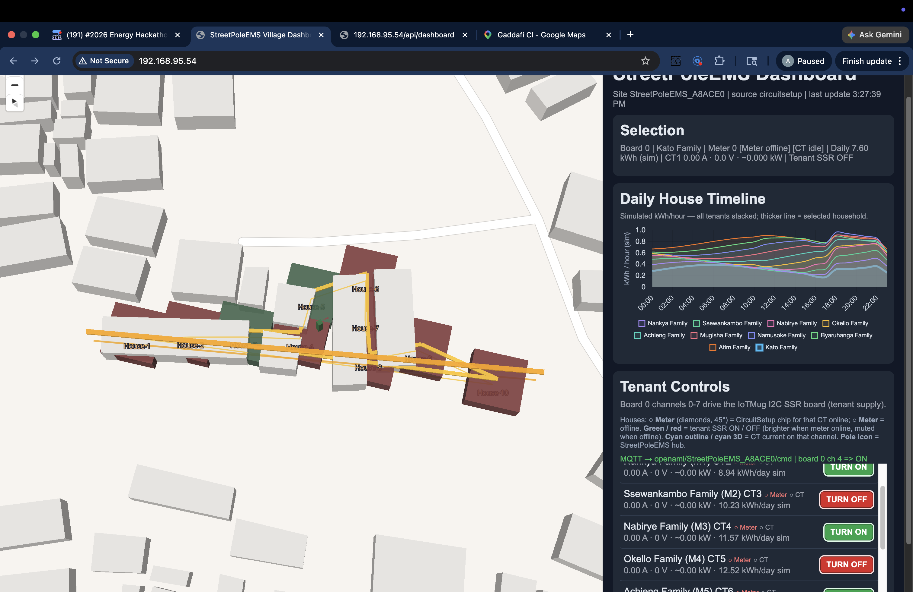

# EIOT.Energy EMS DER/Site Controller Dev Kit - OpenAMI Metering Application

## StreetPoleEMS web dashboard (lab demo)

Operator UI served from the ESP32 (`data/index.html` over Wi‑Fi): 3D map, per-tenant relay controls, timelines, and MQTT command feedback. This capture is from the **Uganda-oriented lab simulation** stack (not a 1:1 production field deployment).

[](uganda_relay_latest.png)

**File:** [`uganda_relay_latest.png`](uganda_relay_latest.png) — earlier capture: [`uganda_relay_01.png`](uganda_relay_01.png)

## Overview
A development kit based on the ESP32S3 N16R8 DEV KIT C1 for energy management systems (EMS) with support for various communication protocols and peripherals. There are a few N16R8 40/42/44 pin layouts. Th EMS kit th \evariant where the rgbw led is top center mounted just below the WROOM ESP32S3 surface mount module. All variants will work except the pins layout differs. 

## Branch `hack-relays` (workshop / hackathon)

**Intent for this branch:** Keep **OpenAMI-style metering** as the base story, but prioritize a **simple operator path**: Modbus (or equivalent) **reads per feed**, plus **discrete relay / SSR control per customer** (8-channel I2C SSR bank on the NESL **EMS 865B**). Cloud topics and full lane-B networking stay **out of scope** until the local meter + relay loop is stable.

**Firmware in this branch:** `include/i2c_ssr_bank.h`, `src/i2c_ssr_bank.cpp`, and `I2C_SSR_*` / `PCF8574_I2C_ADDR` in `include/pins.h`. On boot, USB serial **115200** runs an **I2C scan**; keys **0-7** toggle SSR channels, **a** all off, **?** help.

**Deliverable we want by end of hack:** Documented wiring, working toggle path from firmware to SSR outputs, and a clear mapping table (customer / meter id / relay channel) for field use.

### Current Status

| Subsystem | Status | Notes |
|---|---|---|
| WiFi / MQTT | ✅ Working | Connects to broker, publishes all topics |
| I2C SSR Bank (PCF8574) | ✅ Working | 0x27, channels 0–7 toggle via serial |
| SHT20 Temp/Humidity (Modbus) | ❌ Timeout | See known issue below |
| DDS238 Energy Meters (Modbus) | ❌ Not tested | Addresses set to 0x50–0x52 (wrong); change to 0x01–0x03 to match physical meters |
| MCP2515 CAN | ❌ Init failure | `Entering Configuration Mode Failure` — SPI wiring or crystal freq mismatch |
| Onboard SSR (GPIO38) | ✅ Working | Toggles on relay loop |

### Known Issues

#### SHT20 Modbus Timeout — SoftwareSerial / WiFi Interrupt Contention

`src/modbus_master.cpp` uses `plerup/EspSoftwareSerial` on GPIO 6 (RX) and GPIO 7 (TX) for RS-485. On ESP32-S3 with WiFi active, the WiFi stack's high-frequency interrupts starve the SoftwareSerial GPIO ISR, causing received bytes to be missed and every poll to timeout (`err=0xE2 TIMEOUT`).

**Confirmed:**
- HW-519 TXD → GPIO 6 wire is connected (GPIO 6 idles HIGH as expected)
- RS-485 twisted pair has valid signal (verified with bridge probe)
- Both SHT20 modules (original and replacement) fail identically

**Root cause:** `EspSoftwareSerial` is not interrupt-safe alongside the ESP32-S3 WiFi stack.

**Fix:** Replace `SoftwareSerial _modbus1` with a hardware UART (`Serial1`) routed via the GPIO matrix:
```cpp
// In modbus_master.cpp, replace:
SoftwareSerial _modbus1(RS485_RX_1, RS485_TX_1);
// With:
HardwareSerial _modbus1(1);  // UART1
// And in setup_modbus_master():
_modbus1.begin(9600, SERIAL_8N1, RS485_RX_1, RS485_TX_1);
```
The ESP32-S3 GPIO matrix routes hardware UARTs to any pin, so no rewiring needed.

#### DDS238 Modbus Address Mismatch

Addresses in `src/modbus_master.cpp` are set to `0x50`, `0x51`, `0x52`. Physical meters are typically staged at `0x01`, `0x02`, `0x03`. Update before testing meters.

#### MCP2515 CAN Init Failure

`can.cpp` sets `MCP_CRYSTAL_FREQ MCP_8MHZ`. If the MCP2515 module has a 16 MHz crystal, change to `MCP_16MHZ`. Also verify SPI pins (CS=GPIO2, MISO=GPIO42, MOSI=GPIO41, SCK=GPIO8, INT=GPIO17) are correctly wired.

---

### IOT MUG 8-Channel I2C SSR Board

**Product:** [IOT MUG 8-Channel I2C Solid State Relay Module](https://www.iotmug.com/8-channel-i2c-solid-state-relay-module)

#### I2C Address
The board uses **0x27** (all address DIP switches ON) or **0x3F** (PCF8574A variant). Check the red DIP switch block on the board — the default out of box is **0x27**. Set `PCF8574_I2C_ADDR` in `include/pins.h` to match.

#### Wiring (BOARD_VER_V3)
| SSR Board Pin | EMS Board Connection | GPIO |
|---|---|---|
| VCC | 5V | — |
| GND | GND | — |
| SDA | SSR2 header | GPIO 14 |
| SCL | SSR1 header | GPIO 20 |

`I2C_SSR_SDA_GPIO` and `I2C_SSR_SCL_GPIO` in `include/pins.h` must match the physical wiring. Avoid GPIO46 — it has an internal pull-down that locks up the I2C bus.

#### Channel Mapping
The PCF8574 P0 bit maps to **relay 8** on the IOT MUG board (reversed order):

| Bit | Relay |
|---|---|
| P7 (bit 7) | Relay 1 |
| P6 (bit 6) | Relay 2 |
| ... | ... |
| P0 (bit 0) | Relay 8 |

The firmware uses active-low logic (`I2C_SSR_ACTIVE_LOW 1`) which matches the IOT MUG board.

---

### Upload & Serial Monitor (macOS)

The ESP32-S3 DevKitC-1 has **two USB-C ports**:
- **COM port** (via CH343P UART bridge) — use this for both flashing and serial monitor
- **USB port** (native ESP32-S3 USB) — not needed for normal dev use

Always use the **COM port**. The firmware has `ARDUINO_USB_CDC_ON_BOOT` disabled so `Serial` output goes to UART0 (COM port), keeping flash and monitor on the same connector.

If upload fails with "Resource busy", a `screen` session may be holding the port:
```bash
lsof /dev/cu.usbmodem*   # find the PID
kill <PID>
```

Flash command:
```bash
pio run -t upload --upload-port /dev/cu.usbmodemXXXXX
```

Serial monitor:
```bash
screen /dev/cu.usbmodemXXXXX 115200
# Exit: Ctrl+A, K, Y
```

---

## Web Dashboard + GeoJSON (current hack-relays workflow)

This branch now includes an operator-focused web dashboard served by the ESP32:

- `/` serves `data/index.html` (MapLibre + Chart.js UI)
- `/api/dashboard` returns dashboard JSON with embedded GeoJSON features
- `/api/relay?board=<id>&channel=<id>&state=<0|1>` toggles relay state and returns command result

### Scope clarification (important)

- This dashboard is a **simulation interface running on lab equipment**.
- It is designed to represent a **real field operating context** and field topology we are connected to through an operator relationship.
- It is **not** a 1:1 production deployment of the field control stack.
- In the current lab setup, **SSR channels 0–5** on board 0 drive the IoTMug bank (three tenant households × Primary + Secondary); **SSR 6–7** are unused in this mapping. Per-house data on the map still shows all 10 homes.

### What is shown in the dashboard

- Satellite basemap with site/court geometry
- House points (10 homes) with per-house relay state color:
  - **Green** = connected / relay ON
  - **Red** = disconnected / relay OFF
- A one-day simulated timeline per house (hourly kWh values)
- Relay controls with explicit action buttons:
  - **TURN ON** (green action button)
  - **TURN OFF** (red action button)

### GeoJSON notes

- House points are emitted as proper GeoJSON Point coordinates in `[lon, lat, z]` order.
- Site outline (`court`) and **three circuit** `LineString`s come from **`Circuit1.kmz`**, **`Circuit2.kmz`**, and **`Circuit3.kmz`** (Google Earth paths). Each path is converted at build time into `include/circuit_paths_generated.h` (run `python3 scripts/kmz_to_circuit_paths.py` manually, or rely on the PlatformIO `pre:` script). Aerial ribbon segments (`courtAir`) follow the same vertices.
- The current implementation uses one StreetPoleEMS board with 10 house points for visualization.
- Relay API / MQTT `channel` is **SSR index 0–5** (not per-house index 0–9). Houses on the same secondary circuit share one SSR state on the map.

### Deployment gotcha: upload filesystem content

If `/api/dashboard` works but `/` does not load the UI, upload SPIFFS filesystem assets:

```bash
pio run -t uploadfs --upload-port /dev/cu.usbmodemXXXXX
pio run -t upload   --upload-port /dev/cu.usbmodemXXXXX
```

---

## Nearly Free Energy (Uganda) site-layout reference

The current court/house layout in the dashboard is based on the Nearly Free Energy Sezibwa Homes site-layout page (Uganda), then represented in GeoJSON for this ESP32 dashboard workflow.

- Source page: https://bookstack.nearlyfreeenergy.com/books/business/page/site-layout
- In this repo, house coordinates are embedded in `src/main.cpp` and exposed through `/api/dashboard`. LV circuit polylines are authored as KMZ next to `platformio.ini`, then baked into firmware as above.

When updating site geometry, keep the source-of-truth process simple:

1. Capture site coordinates (survey/GPS or engineering drawing export)
2. Store as `lat,lon` source data
3. Convert to GeoJSON output order `lon,lat`
4. For the three map circuits, edit `Circuit1.kmz`–`Circuit3.kmz` (one `LineString` path each), then rebuild so `circuit_paths_generated.h` updates
5. Validate by opening `/api/dashboard` and confirming house placement on satellite map

(Screenshot of this UI: see **StreetPoleEMS web dashboard** at the top of this README — [`uganda_relay_latest.png`](uganda_relay_latest.png).)

## Features
This development kit supports multiple peripherals using the PlatformIO and Arduino framework:
- RS-485 MODBUS RTU communication
- CANBUS V2.0 interface via SPI
- Input buttons (using voltage divider array on analog GPIO)
- 1.3in OLED Display over SPI (SH1106)


## Hardware Overview

### Core Specifications
- **Processor:** Xtensa® dual-core 32-bit LX7 microprocessor, up to 240 MHz
- **Memory:** 16MB Flash + 8MB PSRAM (N16R8 variant)
- **Connectivity:** Wi-Fi 802.11 b/g/n and Bluetooth 5 (LE)
- **USB:** USB OTG interface with Type-C connector
- **GPIO:** 45 programmable GPIO pins
- **Dimensions:** 51mm x 25.5mm x 10mm
- **Operating Voltage:** 3.3V
- **Datasheet:** [ESP32S3 Technical Reference Manual](https://www.espressif.com/sites/default/files/documentation/esp32-s3_technical_reference_manual_en.pdf)
- **Development Board Datasheet:** [ESP32S3-DevKitC-1 Datasheet](https://docs.espressif.com/projects/esp-dev-kits/en/latest/esp32s3/esp32-s3-devkitc-1/index.html)

### HW-519 Breakout RS-485 MODBUS RTU Module
- Industry-standard RS-485 interface for MODBUS RTU communication
- Built-in transceiver with automatic direction control
- 3-pin screw terminal for easy connection (A, B, GND)
- Supports baud rates up to 115200 bps
- **Operating voltage:** 5V (level-shifted from ESP32-S3 at 3.3V)
- **Module Datasheet:** [RS-485 Transceiver Datasheet](https://www.analog.com/media/en/technical-documentation/data-sheets/MAX1487-MAX491.pdf)

### MCP2515 Breakout - CANBUS V2.0 Interface
- CAN 2.0B compliant controller and transceiver
- Supports standard (11-bit) and extended (29-bit) identifiers
- Maximum bitrate: 1 Mbit/s
- Screw terminals for CANH and CANL connections
- Integrated termination resistors (jumper selectable)
- **Controller Datasheet:** [MCP2515 CAN Controller](https://ww1.microchip.com/downloads/en/DeviceDoc/MCP2515-Stand-Alone-CAN-Controller-with-SPI-20001801J.pdf)
- **Transceiver Datasheet:** [TJA1051 CAN Transceiver](https://www.nxp.com/docs/en/data-sheet/TJA1051.pdf)

### Additional Communication Options
- **BLE/BLE Mesh:** Utilizing ESP32S3's built-in Bluetooth capabilities

### Input/Output Capabilities
- **Button Array Interface:** Analog input with voltage divider network
- **Display:** Optional 1.3" OLED display (SPI interface)
- **Expansion Headers:** Breakout area is available on the perfboard to allow for use of the remaining GPIO pins
- **Relay:** Single 2amp SSR (Solid State Relay) for AC Mains control

### Power Supply Options
- **USB Power:** 5V via USB Type-C connector
- **DC Power:** 5VDC via screw terminals to on board, connects directly to 5VIN of ESP32 (5V input MAX).
- **AC Power:** ⚠️ 120VAC input via screw terminals on board to power supply. 

### ⚠️ WARNING: AC Power Safety
### DANGER - RISK OF ELECTRIC SHOCK, SERIOUS INJURY OR DEATH
This development kit includes a connection for AC power input. When working with AC power (especially 120V/240V mains voltage):

- **Professional Installation Required:** All AC power connections MUST be installed by a qualified electrician in accordance with local electrical codes and regulations.
- **Enclosure Mandatory:** When used with AC power connections, the device MUST be mounted in an appropriate, non-conductive enclosure with restricted access.
- **Safety Precautions:**
- **ALWAYS disconnect AC power** before making any changes to the wiring
- **NEVER touch any AC terminals** or components when power is connected
- Ensure proper grounding of all components
- Install appropriate circuit protection (fuses, breakers)
- Keep AC and DC/logic circuits strictly separate
**Not UL/CE Certified for AC Applications:** This development kit by itself is NOT certified for direct connection to AC mains.

**⚠️ Failure to follow these safety guidelines could result in severe electrical shock, fire, serious injury, or death. ⚠️**

### Physical Specifications
- PCB Dimensions: 150mm x 90mm (main board) includes DIY peripherals expansion area 50mm x 40mm
- Mounting: 4x M3 mounting holes (3.2mm diameter)
- 50mm x 40mm spare PCB room for BYO periperals, sd card, Ethernet, G3 Alliance dual mac/phy, Lora Meshtastic, etc

## Dev Environment Installation Guide
### Prerequisites
- A computer with internet connection
- EMS Dev kit hardware
- USB-C data cable for connecting the development board to your computer

### Step 1: Install Visual Studio Code
1. Download Visual Studio Code from https://code.visualstudio.com/
2. Follow the installation instructions for your operating system:
  - **Windows:** Run the installer and follow the prompts
  - **macOS:** Drag the application to your Applications folder

### Step 2: Install PlatformIO Extension

1. Open VSCode
2. Click on the Extensions icon in the left sidebar (or press Ctrl+Shift+X)
3. Search for "PlatformIO IDE"
4. Click "Install" on the PlatformIO IDE extension
5. Wait for the installation to complete (this may take a few minutes)
6. Restart VSCode when prompted

### Step 3: Clone the Repository
1. Open a terminal/command prompt
2. Navigate to the directory where you want to store the project
3. Clone the repository using git:
4. `git clone https://github.com/nesl-admin/ems-dev.git`
5. `git checkout <your-feature-branch>
6. Follow steps 4 and 5.
7. Use `git commit -s` to sign your Pull Request commits.

### Step 4: Open the Project in VSCode
1. In VSCode, click on the PlatformIO icon in the left sidebar
2. Select "Open Project" from the PlatformIO home screen
3. Navigate to the cloned repository folder and select it
4. Wait for VSCode to load the project and initialize PlatformIO

### Step 5: Configure the Project
1. Wait for PlatformIO to download all required dependencies (libraries)
  **IMPORTANT:** Set the environment to ESP32S3 N16R8 DEV KIT C
  - Open the platformio.ini file in the project root
  - Make sure the environment section contains [env:esp32-s3-devkitc-1 , esp32s3_n16r8] or similar
  - If not, add or modify the environment section to match the ESP32S3 N16R8 DEV KIT C
  - select a latest working branch of project for example visualize vs openami 3phase mqtt vs future others (leakage, diagnostics, etc)

### Step 6: Build and Flash the Firmware
1. Connect your ESP32S3 DEV KIT to your computer via USB-C
2. In VSCode, click on the PlatformIO icon in the left sidebar
3. Select "Project Tasks" from the menu
4. Under "General", click "Build" to compile the project
5. After successful build, click "Upload" to flash the firmware to your device
6. Monitor the progress in the terminal window at the bottom of VSCode

### Troubleshooting

- If you encounter upload errors, ensure that:
  - The correct USB port is selected (can be changed in platformio.ini)
  - You have proper USB drivers installed for your development board
  - Your board is in bootloader mode (if required)
- Check the PlatformIO documentation for additional help: https://docs.platformio.org/


### Front-of-Meter IEEE ISV StreetPoleEMS Integrations

#### Framework & Networking
- Front-of-Meter OPENAMI bidirectional monitor and control PUB/SUB framework
- on board OLED real time energy visualizer graphing and webserver
- StreetPoleEMS MESH distributed intelligence Pub/Sub networking
- Linux Aggregation FLEXMEASURES policy layering export policy enforcement schedules to ESP32S3 EMS - see proposed HLD in Google docs
- EMS MESH networking to N:1 StreetPoleEMS Linux Node Aggregator with distributed AI Energy Policy, N=10~100

#### Metering Plugins
- IVY Metering Bidirectional AC/DC powerflow RCD and RVD leakage modbus monitoring, alarm lines detection
- Donsun DLMS/STS prepaid meter integration
- Donsun postpaid meter integration
- IVY Metering AC/DC meter prepaid/postpaid integration (DLMS/STS)
- Modbus RTU AC Energy Meter plugins (Single Phase, Split Phase, Three Phase)
- Bidirectional AC/DC powerflow RCD and RVD leakage detection
- EVSE AC/DC Charge/Discharge controller plugins
- VFD Modbus RTU plugin
- Energy IoT device plugin

#### Additional Integrations
- ENACCESS OPEN SMART METER libraries for Paygo Dongle support
- OPENPLC integration with IFTTT Rules engine and Modbus PLC endpoint support
- 18650 battery backup with state persistence to flash memory
- RTC clock with sleep and deep sleep power management

### Extended Networking Capabilities
- Ethernet MAC/PHY WAN/LAN dual port
- BLE mesh LAN networking
- G3 ALLIANCE RF+PLC MAC/PHY module for WAN/LAN mesh networking
- LR BLE mesh WAN networking
- LORA Meshtastic LAN/WAN networking
- LORAWAN WAN connectivity
- LTE CATM1 global SIM/eSIM radio module
- Starlink MAC/PHY WWAN radio module integration
- DRONE passby secure ondemand  BLE/wifi  networking, OTA, config, restoration

## Contributing
Check the https://github.com/energy-iot/docs Feel free to suggest additional integration ideas via a pull request or contribute to existing challenges.
