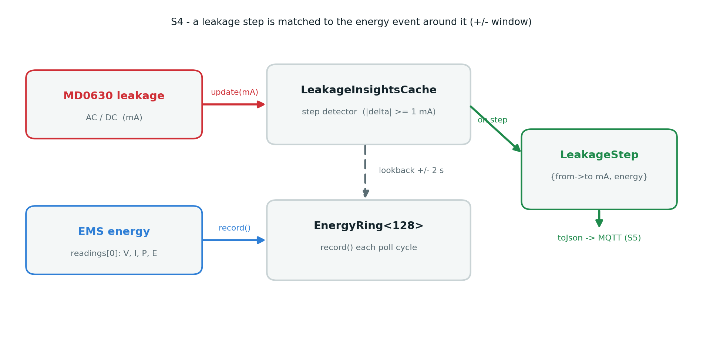
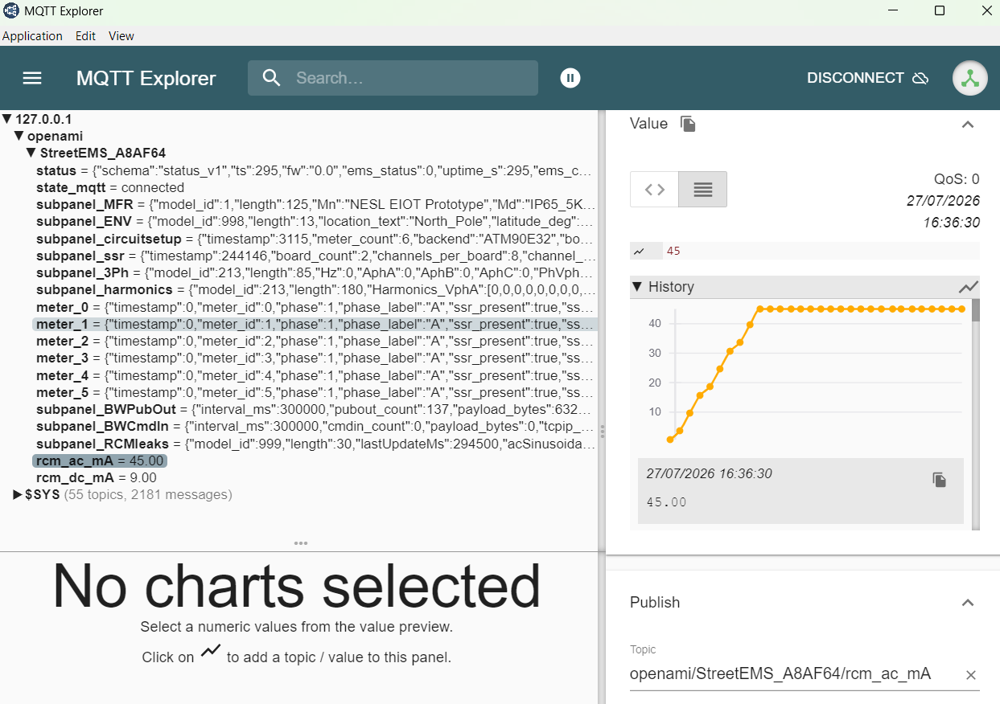
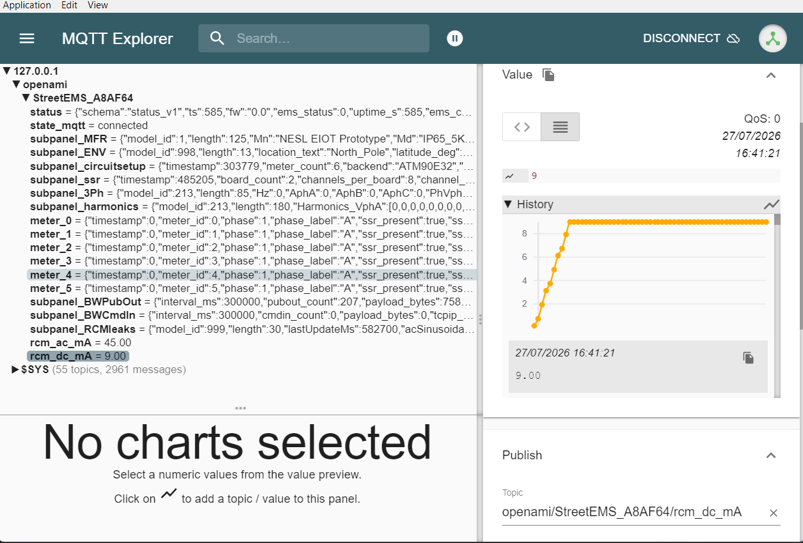

```{=latex}
% =====================================================================
%  TITLE PAGE
% =====================================================================
\begin{titlepage}
\thispagestyle{empty}
\centering

\includegraphics[width=4.6cm,keepaspectratio]{tenpower_logo.png}

\vspace{0.4cm}
{\large\bfseries\color{neslblue} 10Power IoT Fellowship}\\[2pt]
{\normalsize in collaboration with \textbf{NESL} (NorthEast Smart Labs)}

\vspace{1.4cm}
{\color{neslblue}\rule{\linewidth}{1.4pt}}
\vspace{0.5cm}

{\fontsize{20}{25}\selectfont\bfseries\color{neslblue}
Continuous Residual-Current (Leakage) Detection\\[6pt]
for Distributed Energy Management}

\vspace{0.7cm}
{\large\color{neslgreen}
Integrating the IVY MD0630 Type-B RCM into the OpenAMI\,/\,MeshEMS platform:\\[3pt]
from Modbus bring-up to multi-EMS fault isolation and\\[3pt]
reverse-flow-adaptive protection}

\vspace{0.5cm}
{\color{neslblue}\rule{\linewidth}{1.4pt}}

\vspace{1.4cm}
{\normalsize\itshape Consolidated technical report — Sprints S1 to S6}

\vfill

\noindent
\begin{minipage}[t]{0.5\textwidth}
  {\small
   \textbf{Author}\\[2pt]
   Allahaddje Bonheur\\
   IoT Fellow, 10Power\\
   ESP32 firmware \& embedded integration}
\end{minipage}%
\hfill
\begin{minipage}[t]{0.46\textwidth}
  \raggedleft
  {\small
   \textbf{Technical supervision}\\[2pt]
   Glenn — NESL\\[8pt]
   \textbf{Target platform}\\[2pt]
   NESL EMS controller (ESP32-S3, PCB 865B)\\
   Firmware branch \texttt{modbus-testing}}
\end{minipage}

\vspace{0.8cm}
{\color{neslblue}\rule{\linewidth}{0.6pt}}
\begin{center}\small July 2026\end{center}

\end{titlepage}
```

# Executive summary {.unnumbered}

Residual (leakage) current is the direct physical signature of insulation failure. When it flows to
earth it is, at once, a **fire and electrocution hazard** and an early **diagnostic of degrading
equipment**. Modern low-voltage sites — with photovoltaics, battery storage and EV charging — inject a
**DC component** into that leakage, which blinds the ordinary AC-only residual-current device (RCD).
Detecting it requires a **Type-B residual-current monitor (RCM)** and, to make the measurement
*actionable*, an intelligent controller that watches it continuously.

This report documents the design, implementation and hardware validation of exactly that capability
for the **OpenAMI / MeshEMS** energy-management platform (NESL). Over six sprints (S1–S6) the
**IVY MD0630 Type-B AC+DC RCM** was integrated end-to-end into the ESP32-S3 EMS firmware: its Modbus
protocol was reverse-engineered and confirmed (S1); the live AC/DC leakage is read on the EMS (S2); the
life-safety thresholds are written and verified at commissioning (S3); leakage changes are correlated
with energy events (S4); a literature-grounded, multi-EMS **nomination-and-isolation** scheme locates a
leak on a shared feeder and streams it over MQTT (S5); and the module's **hardware alarm outputs** are
sensed while the AC threshold is **adaptively tightened under reverse power flow** (S6).

The work follows the supervisor's **"path of least blockage"** engineering method — build with
configurable parameters and a mock pipeline so progress never stalls on an unknown, then confirm each
assumption against real hardware. Every sprint is proven: the register map was confirmed against the
vendor tool; live reads ran 12/12 with zero failures; threshold writes were traced to the correct
Modbus function code; and the S6 alarm path was flashed and validated on the bench — a process that
uncovered and fixed three defects only real hardware reveals (pin availability, alarm polarity, and
sampling latency). The result is a complete, tested, and documented leakage-detection subsystem, ready
for feeder-scale deployment.

```{=latex}
\newpage
\tableofcontents
\newpage
```

# Nomenclature {.unnumbered}

\begin{longtable}{ll}
\toprule
\textbf{Term} & \textbf{Meaning} \\
\midrule
AMI      & Advanced Metering Infrastructure \\
CRC      & Cyclic Redundancy Check (Modbus frame integrity) \\
DC/AC    & Direct / Alternating current component of the residual current \\
EMS      & Energy Management System (the NESL ESP32-S3 controller) \\
FC       & Modbus Function Code (FC03 read, FC06 write-single, FC16 write-multiple) \\
FLISR    & Fault Location, Isolation and Service Restoration \\
GPIO     & General-Purpose Input/Output pin \\
LV       & Low Voltage (distribution level) \\
MQTT     & Message Queuing Telemetry Transport (publish/subscribe messaging) \\
Modbus RTU & Serial fieldbus protocol used by the MD0630 \\
PV / EV  & Photovoltaic / Electric Vehicle \\
RCD / RCM & Residual-Current Device (protective) / Monitor (measuring) \\
RCM Type B & Monitor sensing AC \emph{and} DC residual current \\
RS-485 / UART & Serial physical / logic layers \\
$I_{res}$ / $V_{res}$ & Residual current / residual voltage \\
\bottomrule
\end{longtable}

# Introduction, context and objectives

## Why leakage current matters

In a healthy installation, the current leaving through the live conductor returns entirely through the
neutral; their vector sum is zero. **Residual (leakage) current** is the small imbalance that appears
when part of the current finds an unintended path to earth — through degraded insulation, moisture, or
a person in contact with a fault. It is therefore both a **safety** quantity (fire, electric shock) and
a **condition-monitoring** quantity (insulation ageing, water ingress, developing faults).

Classical protection uses a **Type-AC or Type-A RCD**, which only sees alternating residual current.
The modern LV site breaks that assumption: PV inverters, battery converters and EV chargers can inject
a **smooth DC residual current**, which can magnetically **saturate a conventional RCD's core and
prevent it from tripping** — a documented safety gap addressed by the Type-B classification
[1, 2]. A **Type-B RCM** measures both the AC and the DC residual current and is the correct sensor for
a site with power electronics on it.

Measuring the leakage, however, is only half of the problem. A bare RCM trips its own relay locally; it
does not tell a distributed energy system *where* on a shared feeder the leak is, whether it is
worsening, or how it correlates with what the site is doing. Turning the measurement into **actionable
intelligence** — detection, localisation, isolation and adaptive protection — is the contribution of
this work.

## The host platform: OpenAMI / MeshEMS

The sensor is not a standalone product; it is a subsystem of the NESL **Energy Management System
(EMS)** — an ESP32-S3 controller (PCB 865B) that already meters energy, controls relays and speaks
MQTT within the OpenAMI / MeshEMS ecosystem (Street-, Build- and DTM-EMS variants). Multiple EMS share
a low-voltage feeder, which is precisely what makes **coordinated**, multi-node leakage isolation both
possible and valuable.

{#fig-ems width=54%}

## Engineering method: the "path of least blockage"

The assignment was run under two directives from the supervisor that shaped every design decision:

1. **Analyse, design, review — then code.** Each sprint began with a written design note and a review,
   not with firmware. This report is the consolidation of those notes.
2. **Never stay blocked.** Where a fact was unknown (e.g. the exact register offsets), the driver was
   built with **configurable parameters** and a **mock data pipeline**, so the whole chain
   (data model $\rightarrow$ MQTT $\rightarrow$ insights) could run and be tested *before* the hardware
   answer arrived — and the assumption was then confirmed against the real device.

This method is visible throughout: mock ramps that stand in for a rising leak, build flags that isolate
each capability, and a discipline of **confirming every assumption against real hardware or the
vendor's own tool** before treating it as fact.

## Objectives and sprint structure

**General objective.** Integrate a Type-B AC+DC leakage monitor into the EMS firmware so the platform
can *continuously* detect, localise and act on residual-current faults across a shared feeder.

The work was decomposed into six sprints, summarised in @tbl-sprints and detailed in the following
sections.

| Sprint | Objective | Outcome |
|:--|:--|:--|
| **S1** | Modbus bring-up + derive the register map | Map derived and confirmed vs vendor tool |
| **S2** | Read live AC/DC leakage on the EMS | 12/12 reads, 0 failures |
| **S3** | Write life-safety thresholds, with read-back | Solved via FC16 (not FC06); verified |
| **S4** | Correlate leakage changes with energy events | Cache implemented; exercised end-to-end |
| **S5** | Multi-EMS nomination + MQTT isolation | Literature-grounded; proven on device + MQTT |
| **S6** | Hardware alarm sense + reverse-flow threshold | Implemented; **alarm path verified on HW** |

: The six sprints of the leakage-detection assignment. {#tbl-sprints}

# S1 — Modbus bring-up and register-map derivation

## Problem

The MD0630 is documented as a Modbus RTU device, but its datasheet gives **no register offsets, no
function code and no scaling** — the exact information a driver needs. S1's goal was to establish serial
communication and derive that map, first on a PC bench (per the "path of least blockage": prove the
protocol before committing the EMS bus).

## Method and result

The module was powered at **12 V** and connected to the PC through a USB-TTL adapter acting as the
Modbus master. The single detail that unblocked communication was electrical: the module's UART is
**open-drain and needs pull-ups**, and — because the lab adapter exposed no VCC wire — those pull-ups
were fed from an ESP32 5 V pin, **with every ground tied to a single common ground** (@fig-s1-wiring).

{#fig-s1-wiring width=86%}

Once the link was live (address 1, 9600 8N1), the register block was found by scanning — a 7-wide read
returned *illegal data address* (`0x02`), narrowing the valid block to `0x0000–0x0005` — and every
field was then **cross-checked against IVY's own `CT.exe` tool**, whose raw frames are authoritative.

| Register | Default (raw / ×0.1 mA) | Field | Access |
|:--|:--|:--|:--:|
| `0x0000` | 0 / 0.00 | DC leakage current | R |
| `0x0001` | 0 / 0.00 | AC leakage current | R |
| `0x0002` | 60 / 6.0 | DC threshold | R/W |
| `0x0003` | 300 / 30.0 | AC threshold | R/W |
| `0x0100` | 1 | Version | R |
| `0x0111` | 5 | Minor version | R |

: Derived MD0630 register map (FC 0x03, scaling raw × 0.1 mA). Defaults match the datasheet: DC 6 mA,
AC 30 mA. {#tbl-regmap}

```{=latex}
\begin{keybox}[S1 — key result]
Communication established at \textbf{address 1, 9600 8N1, FC 0x03, scaling raw $\times$ 0.1 mA}.
The register map (\ref{tbl-regmap}) was derived from the live device and \textbf{independently
confirmed against the vendor's \texttt{CT.exe} frames} — resolving it as neither the earlier proposed
specification nor the raw configuration-file field order.
\end{keybox}
```

# S2 — Live AC/DC read on the EMS

## Objective

Move the module off the PC and have the **EMS itself** read the live residual current over its own
serial bus, feeding the values into the firmware's energy data model (`leakageModel`, published on the
`subpanel_RCMleaks` topic).

## Method and result

A useful finding simplified the wiring: the MD0630 exposes **plain UART logic**, not RS-485
differential, so it connects **directly** to the ESP32 UART pins with no transceiver (@tbl-s2-wiring).
Pull-ups go to **3.3 V** — the ESP32-S3 GPIOs are **not** 5 V-tolerant, and the open-drain TX means the
pull-up rail sets the (safe) logic-high level.

| Module | ESP32-S3 | Note |
|:--|:--|:--|
| TX | GPIO42 (RS485\_1 RX) | + 4.7 k$\Omega$ pull-up to 3V3 |
| RX | GPIO7 (RS485\_1 TX) | + 4.7 k$\Omega$ pull-up to 3V3 |
| GND | GND | common ground (EMS + module + 12 V PSU$-$) |
| VCC | 12 V PSU | never the ESP32 |

: S2 bench wiring — direct UART, no transceiver. {#tbl-s2-wiring}

{#fig-s2-wiring width=86%}

Two defects were found and fixed, both instructive:

- **Wrong pins.** The wires were first landed on the board's silkscreen "RX/TX", which are the **USB
  console UART** (GPIO44/43), not the Modbus bus (GPIO42/7) — the read simply timed out until the wires
  were moved to the numbered pins.
- **Address collision.** The on-board SHT20 temperature sensor is also polled at **address 1**, so the
  two pollers collided on the shared bus and reads were intermittent; a bring-up build flag that skips
  the SHT20 poll produced reliable reads. (In production the CT is commissioned to node 100, so the two
  coexist.)

```{=latex}
\begin{keybox}[S2 — key result]
The EMS reads the physical module reliably: \textbf{12 consecutive successful reads, 0 failures}, both
channels 0.00 mA at rest (no induced leakage). S1's derived map is thereby validated on the target
hardware, not merely on the PC bench.
\end{keybox}
```

# S3 — Config-time threshold writes

## Objective

Write the module's **life-safety thresholds** — DC 6 mA (`0x0002`), AC 30 mA (`0x0003`) — at
commissioning, **always confirmed by a read-back**, and never from the polling loop.

## The investigation

The first write attempt exposed a classic embedded pitfall. An **FC 0x06 (write single register)** was
*accepted* by the module — no Modbus exception was returned — yet the register **never changed**. Only
the read-back safety caught it (wrote 27 mA, read back 30 mA, rejected the write). Rather than assume an
undocumented "unlock" sequence, the vendor tool was **sniffed** performing a write over the USB-TTL: its
frames revealed the answer.

```text
Write : 00 10 00 03 00 01 02 01 0E 2B A7   <- FC 0x10, reg 0x0003, qty 1, value 0x010E = 270 = 27.0 mA
Read  : 00 10 00 03 00 01 F0 18            <- success; NO unlock frame anywhere
```

The MD0630 **silently ignores FC 0x06** and **requires FC 0x10 (write multiple registers)** — no unlock
exists. The driver's `writeThreshold_mA()` now writes via FC16 and enforces a read-back:

| Step | Action |
|:--:|:--|
| 1 | `setTransmitBuffer(0, mA × 10)` — e.g. 30 mA $\rightarrow$ 300 = `0x012C` |
| 2 | `writeMultipleRegisters(reg, 1)` — FC 0x10 to `0x0002` (DC) or `0x0003` (AC) |
| 3 | 40 ms settle, then **read back** (FC 0x03) |
| 4 | **Confirm**: read-back == written $\rightarrow$ OK; else **reject** (`0xE4`) |

: The write is never trusted without a matching read-back. {#tbl-s3-flow}

On the EMS this swept AC 30 $\rightarrow$ 27 $\rightarrow$ 30 mA with matching read-backs, then restored
the safe factory defaults (DC 6 / AC 30 mA).

```{=latex}
\begin{keybox}[S3 — key result]
Threshold writes work via \textbf{FC 0x10 with mandatory read-back}, verified on the EMS. The earlier
``unlock required'' hypothesis was \textbf{wrong} — the blocker was the function code (FC06 vs FC16),
established by tracing the vendor tool rather than guessing.
\end{keybox}
```

Per the supervisor's safety rules, writes are **config-time only**, target **only** the two confirmed
threshold registers, always read back and reject on mismatch, and the vendor tool's *Calibration*
function (factory-only) is never invoked.

# S4 — Energy-change correlation

## Rationale

A leak rarely appears in isolation from what the site is *doing*: a step in residual current that
coincides with a load switching on, a PV ramp, or an EV session is far more diagnostic than a bare
number. S4 builds the data foundation for that reasoning — a cache that, whenever the leakage steps,
looks back over recent energy activity and answers *"what energy event happened when the leakage
changed?"*.

{#fig-s4 width=86%}

## Design

Two independent streams meet in the cache (@fig-s4). The **EMS energy** (`readings[0]`) is continuously
recorded into a ring buffer of 128 timestamped snapshots, each deriving the active-power **ramp**
against the previous sample. The **leakage reading** drives a step detector that fires when
$|\Delta| \ge 1\,\text{mA}$; on a step it queries the ring for the nearest snapshot within a
$\pm 2\,\text{s}$ window and attaches it to the event.

Three design choices reflect the domain:

- **Change-based, not level-based.** Acting on *steps* — not the always-present standing residual —
  avoids false triggers, matching the change-trigger principle later confirmed in the S5 literature.
- **Generic energy ring**, so the same pattern is reusable for other insights (neutral balance,
  harmonics) — aligning with the supervisor's repeatable *Insights-Manager* framework.
- A reserved **`phase_angle_deg`** field: zero today (the MD0630 is absolute-value only), but exactly
  the quantity a future RCM upgrade fills to obtain **leakage direction** (see S5).

```{=latex}
\begin{keybox}[S4 — key result]
An energy-change correlation cache (\texttt{EnergyRing}, \texttt{LeakageInsightsCache}) links each
leakage step to the surrounding energy event. It compiles and is exercised end-to-end by the mock
ramp; it is the structured input the S5 manager consumes.
\end{keybox}
```

# S5 — Multi-EMS nomination and MQTT isolation

## Objective and literature grounding

When several EMS share a feeder, a single leak is visible — at different magnitudes — to several of
them. S5 answers *which* EMS is nearest the fault and how to isolate it. The scheme is deliberately
**grounded in the fault-location literature** rather than in intuition; two open-access sources were
read in full [4, 5] and a phase-angle criterion extracted [6]:

- **Nominate the "odd one out", not the loudest.** Faulty-feeder identification compares the *trend
  correlation* of the transient across feeders and selects the one that **correlates least** with its
  peers ($\text{faulted} = \arg\min_k \mu_k$) [4]. Because EMS sit at different feeder positions, their
  absolute levels are heterogeneous; trend-correlation is robust to that. The design therefore ranks by
  **magnitude and by lowest peer-correlation**, gated by a confidence score.
- **Trigger on change, not level** [4] — consistent with S4.
- **Isolate on both sides.** FLISR practice opens switches on **both** sides of the faulted section so
  only the damaged segment is de-energised, running either fully automatic or operator-approved [5] —
  mapped here to bracketing the two EMS around the leak, with the auto-vs-alert decision set by the
  confidence gate.
- **Direction by phase angle.** The residual-voltage/residual-current criterion
  $|\angle V_{res} - \angle I_{res} - 90^\circ|$ distinguishes upstream from downstream [6] — the
  principled basis for the reserved `phase_angle_deg` field and the RCM-upgrade path.

{#fig-s5 width=92%}

## Implementation and evidence

The `LeakageInsightsManager` implements a per-EMS state machine
(`normal → watch → isolating → fault → restored`), a ramp **signature** for correlation, and the three
MQTT payloads (telemetry, isolation round, alert). Nomination combines magnitude and minimum
peer-correlation and **boosts confidence when the magnitude leader is also the odd-one-out**, de-rating
it under reverse power flow.

Run on **one ESP32** with two simulated peers (mid $\approx 0.4\times$, far $\approx 0.1\times$), the
nominated node is both the magnitude leader *and* the least-correlated node, giving confidence **0.82**
and an auto-isolate decision. The leakage was then streamed over **MQTT to a broker on the PC** over a
real WiFi network — and charted live as the mock ramp rose and held at its ceiling (figures below).

::: {layout-ncol=2}
{#fig-ac width=99%}

{#fig-dc width=99%}
:::

::: {custom-style="caption"}
Figure: Live leakage telemetry charted in MQTT Explorer (`rcm_ac_mA` / `rcm_dc_mA`).
:::

```{=latex}
\begin{keybox}[S5 — key result]
A literature-grounded nomination (magnitude \emph{and} peer-correlation, confidence-gated) locates a
leak across three EMS on one ESP32, and the live leakage streams over MQTT with fault flag and live
charts. A WPA3/PMF hotspot blocked the ESP32's older WiFi stack; a WPA2 hotspot connected immediately —
a documented deployment constraint.
\end{keybox}
```

# S6 — Hardware alarm sense and reverse-flow-adaptive protection

S6 closes the loop between the module and the EMS in two directions (@fig-s6): the EMS **observes** the
module's own hardware alarm (A), and it **adapts** the AC threshold to the site's power-flow direction
(B).

{#fig-s6 width=94%}

## (B) Reverse-power-flow adaptive threshold

Under **export** (PV/battery back-feed) the acceptable leakage budget changes, so the AC limit is
tightened **30 $\rightarrow$ 27 mA** and restored on return to import. Export is detected from the
meter's active power ($< -50\,\text{W}$). Crucially, the threshold is re-written **only on a debounced
transition** (three poll cycles) — never every cycle — reusing the S3 FC16 + read-back path so the
module's store is protected. The live export flag is also fed into the S5 manager so nomination
**de-rates confidence under reverse flow**.

## (A) Hardware alarm sense — and its hardware validation

The MD0630 trips its own internal relay when leakage crosses a threshold (the life-safety path,
independent of firmware). S6-A lets the EMS **observe** those AC/DC/fault alarm outputs so a trip is
logged and published — deliberately **read-only**: it never drives the trip. Each 5 V output reaches a
GPIO through a **single 4.7 k$\Omega$ series resistor** — a level shift that is safe for *any* output
type without a multimeter (an open-collector reads low when active; a push-pull 5 V high is clamped by
the GPIO's internal ESD diode with the resistor limiting the injected current to $\approx$ 0.36 mA).

Flashing this on the bench turned into the most instructive part of the whole assignment: **three
defects surfaced that only real hardware reveals**, and each was fixed and re-verified.

| Defect found on hardware | Diagnosis | Fix |
|:--|:--|:--|
| Chosen pins GPIO 33/34 absent on the devkit | not broken out on the ESP32-S3-DevKitC-1 (they were custom-PCB pins) | move to GPIO 39/40/21 (free header pins) |
| False `AC=1 DC=1` at rest | outputs sit **low at rest, high on alarm** — i.e. active-**high**, not active-low | `active_low=false` + `INPUT_PULLDOWN` |
| Manual pulse missed by the logger | alarm sampled only at the ~seconds Modbus poll | fast `service_leakage_alarms()` at ~50 Hz, decoupled |

: S6-A defects found and fixed during on-hardware verification. {#tbl-s6-defects}

After the fixes, the rest state reads correctly quiet and a stimulus on the AC line is logged live:

```text
SETUP: MODBUS: MD0630 alarm sense on GPIO 39/40/21 (AC/DC/fault, active-high)
S6 ALARM edge: AC=0 DC=0 FAULT=0     # at rest, no leakage — quiet
S6 ALARM edge: AC=1 DC=0 FAULT=0     # AO asserted (3V3 pulse on GPIO39)
S6 ALARM edge: AC=0 DC=0 FAULT=0     # released  — DC/FAULT correctly stay 0
```

```{=latex}
\begin{keybox}[S6 — key result]
Both paths are implemented and gated behind build flags (the firmware builds cleanly with S6 off and
with every S6 path on). \textbf{S6-A was verified on hardware end-to-end} — module alarm output
$\rightarrow$ 4.7 k$\Omega$ $\rightarrow$ GPIO $\rightarrow$ firmware logs \texttt{AC=1} within
$<$ 200 ms — after fixing pin availability, alarm polarity and sampling latency. S6-B reuses the proven
S3 write path.
\end{keybox}
```

# Consolidated results and validation

@tbl-results collects the verification status of each capability. The distinction between *code-proven*
(exercised by the mock pipeline) and *hardware-proven* (validated against the physical module) is kept
explicit — an honesty the "path of least blockage" method demands.

| Capability | Verification | Status |
|:--|:--|:--|
| Modbus link + register map (S1) | live device + vendor `CT.exe` frames | hardware-proven |
| Live AC/DC read (S2) | 12/12 reads, 0 failures on the EMS | hardware-proven |
| Threshold write + read-back (S3) | AC 30$\to$27$\to$30 mA on the EMS; FC16 traced | hardware-proven |
| Energy-change correlation (S4) | compiles; step$\to$correlation via mock ramp | code-proven |
| Nomination + MQTT isolation (S5) | 3-EMS round on one ESP32; live MQTT + charts | hardware-proven (mock peers) |
| Reverse-flow threshold (S6-B) | builds; transition-only FC16 write path | code-proven |
| Hardware alarm sense (S6-A) | live `AC=1`/`AC=0` on the EMS, $<$200 ms | hardware-proven |

: Consolidated verification status across S1–S6. {#tbl-results}

The firmware builds cleanly in both the default configuration (all leakage test flags off — no
regression) and with every S1–S6 capability compiled in, at ~19 % RAM and ~28 % flash on the ESP32-S3.

# Discussion, limitations and perspectives

**What the work demonstrates.** A commodity Type-B RCM with an undocumented protocol was turned into a
fully-integrated, continuously-monitored EMS subsystem: protocol reverse-engineered and confirmed,
values read live, thresholds safely written, changes correlated with energy, leaks nominated and
isolated across a feeder, and hardware alarms sensed while protection adapts to power-flow direction.
Just as important, the process was **honest about assumptions** and **confirmed them on real
hardware** — which is exactly what surfaced the FC06/FC16 issue and the three S6 hardware defects.

**Limitations.** The peers in the S5 nomination are simulated on a single ESP32; a true feeder trial
needs several EMS publishing on shared topics. The energy-correlation thresholds (S4) are set against a
bare bench and want tuning against real metered load. And the MD0630 reports the leakage **magnitude
only** — without phase, the nomination ranks proximity but cannot yet resolve **direction** (upstream
vs downstream).

**Perspectives.** Three lines follow naturally. **(1)** Replace the simulated peers with real
multi-EMS MQTT nomination on the shared `lvfeeder/…` topics. **(2)** Complete the S6 bench captures — the
reverse-flow 30$\leftrightarrow$27 mA switch on the live module, and a genuine $>$30 mA leak tripping
the alarm. **(3)** Adopt an RCM exposing the **residual-voltage/current phase angle**, which upgrades
the magnitude ranking to true **direction-based isolation** via the
$|\angle V_{res} - \angle I_{res} - 90^\circ|$ criterion [6] — the field already reserved in the data
model since S4.

# References {.unnumbered}

\begin{enumerate}
\item IEC 60755, \emph{General requirements for residual current operated protective devices},
International Electrotechnical Commission.
\item IEC 62955, \emph{Residual direct current detecting device (RDC-DD) to be used for mode 3 charging
of electric vehicles} — Type-B / DC residual-current detection.
\item Modbus Organization, \emph{MODBUS Application Protocol Specification}, V1.1b3.
\item \emph{Faulty Feeder Identification in a distribution network by data analysis and similarity
(trend-correlation) comparison of zero-sequence transients}, PMC7795609 (open access, read in full).
\item \emph{FLISR — Fault Location, Isolation and Service Restoration: workflow and practice} (read).
\item \emph{An additional criterion for faulty-feeder selection during ground faults using the
$V_{res}/I_{res}$ phase angle ($\approx 90^\circ$)}.
\item IVY Metering, \emph{MD0630 Type-B AC+DC residual-current monitor} — datasheet and \texttt{CT.exe}
configuration tool (vendor).
\end{enumerate}

::: {.unnumbered}
\vspace{0.4cm}
\noindent\rule{\linewidth}{0.4pt}\\
{\small\itshape Repository: \texttt{docs/leakage\_MD0630TA1A/} on branch \texttt{modbus-testing}.
This consolidated report is built from the per-sprint reports (S1–S6) and the on-hardware bench evidence
(\texttt{S6\_bench\_evidence.md}); all source, drivers and diagrams are version-controlled.}
:::
