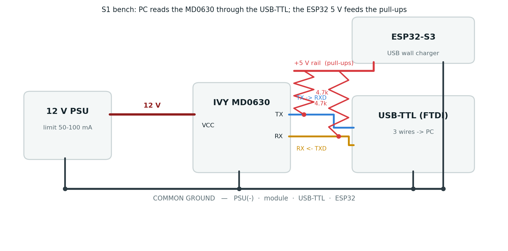

## Objective

Sprint **S1** of the leakage-detection assignment (supervisor: Glenn, NESL): get **RS-485 / Modbus
serial communication working — first PC → IVY RCM CT** — and **derive the Modbus register map**
(offsets, function code, scaling) so the ESP32 driver (S2) can read continuous AC/DC leakage.

**Result: S1 is complete.** The module communicates, and the full register map has been derived from
the live device and independently confirmed against IVY's own PC tool (`CT.exe`).

## Bench setup

The module was brought up on the PC first (per Glenn's directive), using a USB-TTL adapter as the
Modbus master interface. Because the lab's USB-TTL cable exposes no VCC wire, the required TX/RX
pull-ups were fed from an ESP32 5 V pin, with **all grounds tied to a single common ground**.

{#fig-wiring width=100%}

**Key wiring points** (the ones that unblocked communication):

- Module powered at **12 V** (VCC/GND — never reversed/shorted).
- Module **TX → USB-TTL RXD**, module **RX → USB-TTL TXD** (crossed).
- **4.7 kΩ pull-ups** on TX and RX (the datasheet requires them; the module TX is open-drain).
- **Common ground** across PSU(−), module, USB-TTL **and** the ESP32 that sources the 5 V rail — this
  last link was essential.

## Serial parameters (confirmed)

Confirmed from IVY's `CT.exe` "Serial Ports" dialog and reproduced with a direct Modbus prober:

| Parameter    | Value                                                        |
|--------------|--------------------------------------------------------------|
| Baud / format| **9600 · 8 · N · 1**                                         |
| Slave address| **1** (`CT.exe` uses broadcast 0x00 in its frames; addr 1 also answers) |
| Function code| **FC 0x03** (holding) — FC 0x04 (input) returns the same values |
| Scaling      | **raw × 0.1 mA** (60 → 6.0 mA, 300 → 30.0 mA)                |

## Register map (derived)

`CT.exe` reads the device in three groups. Decoding its frames and matching them to the tool's
labelled fields gives the following map.

| Register | Raw (default) | ×0.1 mA | Field                    | Access |
|----------|---------------|---------|--------------------------|--------|
| `0x0000` | 0             | 0.00    | **DC Leakage Current**   | R      |
| `0x0001` | 0             | 0.00    | **AC Leakage Current**   | R      |
| `0x0002` | 60 (0x003C)   | 6.0     | **DC Threshold**         | R/W    |
| `0x0003` | 300 (0x012C)  | 30.0    | **AC Threshold**         | R/W    |
| `0x0100` | 1             | —       | **Version Number**       | R      |
| `0x0111` | 5             | —       | **Minor Version Number** | R      |
| Modbus ID| 1             | —       | slave address            | R/W    |

: Derived MD0630 register map. Defaults match the datasheet (DC 6 mA, AC 30 mA). {#tbl-regmap}

> **Note.** The DC-vs-AC assignment of `0x0000`/`0x0001` is inferred from the DC-before-AC ordering of
> the thresholds (both leakage registers read 0 at rest); it should be confirmed by inducing a known
> DC or AC leak and re-reading.

## Evidence — `CT.exe` communication log

The raw Modbus frames captured from IVY's tool (authoritative):

```text
Write : 00 03 00 00 00 06 C4 19
Read  : 00 03 0C 00 00 00 00 00 3C 01 2C 01 2D 00 00 AF 91   -> 0, 0, 60, 300, 301, 0
Write : 00 03 01 00 00 01 84 27
Read  : 00 03 02 00 01 44 44                                 -> 0x0100 = 1   (Version)
Write : 00 03 01 10 00 02 C5 E3
Read  : 00 03 04 00 00 00 05 7B 30                           -> 0x0111 = 5   (Minor Version)
```

`CT.exe` labelled read-out: Modbus ID 001 · Version 0001 · Minor Version 0005 · DC Threshold 6.0 mA ·
AC Threshold 30.0 mA · DC Leakage 0.00 mA · AC Leakage 0.00 mA.

A second, independent read using a direct prober (address 1, our own frames) returned the same block:

```text
TX : 01 03 00 00 00 06 C5 C8
RX : 01 03 0C 00 00 00 00 00 3C 01 2C 01 2D 00 00 ...
```

## Method summary

1. Wire PC ↔ module over the USB-TTL with pull-ups and a shared common ground.
2. Confirm the link: the module answers at address 1, 9600 8N1 (both FC03 and FC04).
3. A read of `0x0000`+7 returned exception `0x02` (illegal data address) → the block is not 7-wide.
4. Scan single registers → valid block `0x0000–0x0005`; a 6-register read returns a clean frame.
5. Cross-check with `CT.exe`: its three read groups and labelled fields fix every register's meaning.

## Impact on the design

- **Answers the register-map question.** The real layout is **neither** the earlier AI-proposed spec
  (AC leakage at `0x00`, thresholds at `0x04`/`0x05`) **nor** the raw `CT.db` field order — it is
  @tbl-regmap.
- **Driver updated.** `include/metering/modbus_md0630.h` `RegMap` and `read_fc = FC_HOLDING` now carry
  these confirmed offsets; the mock pipeline (data model → MQTT `subpanel_RCMleaks`) is unchanged.

## Next steps (S2 / S3)

1. **S2 — real read:** wire the module onto the **ESP32 RS-485/UART bus** (production path, not the PC
   USB-TTL used here) and read continuous AC/DC leakage into the energy data model.
2. **S3 — threshold writes:** write `0x0002` (DC) / `0x0003` (AC) via **FC 0x06**, value = mA × 10.
   `CT.exe` shows an `unLock ID` step, so verify the unlock sequence first, and **always read back to
   confirm** (per Glenn). Default life-safety values: DC **6 mA**, AC **30 mA**.
3. **Confirm DC-vs-AC** of `0x0000`/`0x0001` by inducing a known leak.

---

*Repository:* `docs/leakage_MD0630TA1A/` — full details in `S1_register_map_findings.md`;
driver in `include/metering/modbus_md0630.h` + `src/metering/modbus_md0630.cpp`.
