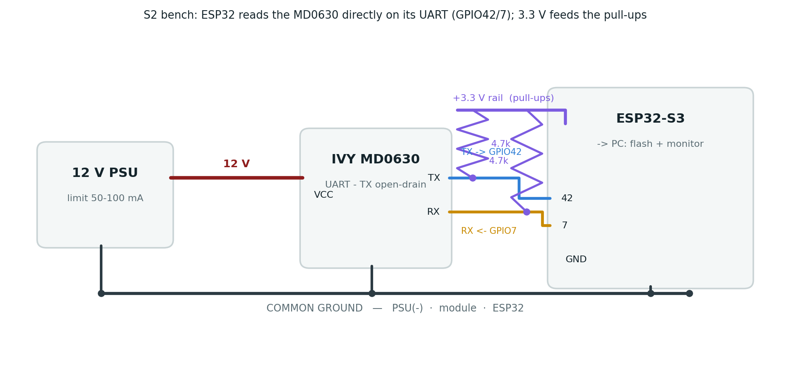

## Objective

Sprint **S2** of the leakage-detection assignment (supervisor: Glenn, NESL): move the module off the
PC bench and have the **ESP32 itself read the live AC/DC residual current** from the MD0630 over its
own RS-485/UART bus, using the register map derived in S1, and feed the values into the energy data
model (`leakageModel`, published on `subpanel_RCMleaks`).

**Result: S2 is complete.** The `Modbus_MD0630` driver, switched from mock to real reads, reads the
live module **reliably** on the ESP32 (12 consecutive reads, 0 failures).

## Bench setup

The MD0630 speaks plain **UART** (not RS-485 differential), so it connects **directly** to the ESP32
UART pins — no transceiver. The module is powered at 12 V; the ESP32 (powered from USB for flashing
and the serial monitor) also sources the **3.3 V** pull-up rail, with every ground tied common.

{#fig-wiring width=100%}

**Wiring**

| Module | ESP32 | Note |
|--------|-------|------|
| TX  | **GPIO42** (RS485_1 RX) | + 4.7 kΩ pull-up to **3V3** |
| RX  | **GPIO7** (RS485_1 TX)  | + 4.7 kΩ pull-up to **3V3** |
| GND | GND | common ground (ESP32 + module + 12 V PSU−) |
| VCC | **12 V** PSU | never the ESP32 |

: S2 bench wiring. {#tbl-wiring}

**Two safety/clarity points:**

- Pull-ups go to **3V3**, not 5 V: the ESP32-S3 GPIOs are **not** 5 V tolerant, and the module TX is
  open-drain, so the pull-up voltage sets the (safe) logic-high level.
- The pins are the **GPIO numbers 42 / 7** — *not* the silkscreen "RX"/"TX", which are the USB console
  UART (GPIO44/43).

## Firmware configuration

Serial layer and register map are the confirmed S1 values (9600 8N1, address 1, **FC 0x03**, ×0.1 mA).
The driver reads `0x0000` (DC) and `0x0001` (AC) each cycle.

- `LEAKAGE_MOCK` and `LEAKAGE_PROBE` **off** → the driver performs **real reads**.
- `LEAKAGE_BRINGUP` **on** → skips the SHT20 poll during bring-up (see @sec-gotchas).
- WiFi/MQTT off for the bench (the lab WiFi retry loop otherwise blocks the main loop, so the Modbus
  poll ran only ~once per minute).

## Evidence — serial capture (module at rest, no induced leakage)

```text
SETUP: MODBUS: MD0630 leakage CT: address:1
MD0630 [addr:1 fc:0x03]: AC=0.00 mA  DC=0.00 mA  (ok:9  fail:0)
MD0630 [addr:1 fc:0x03]: AC=0.00 mA  DC=0.00 mA  (ok:10 fail:0)
MD0630 [addr:1 fc:0x03]: AC=0.00 mA  DC=0.00 mA  (ok:11 fail:0)
MD0630 [addr:1 fc:0x03]: AC=0.00 mA  DC=0.00 mA  (ok:12 fail:0)
```

**12 consecutive successful reads, 0 failures.** Both channels read 0.00 mA at rest (no leakage
induced). The driver scales ×0.1 mA and calls `leakageModel.updateAll(...)`.

## Two gotchas resolved {#sec-gotchas}

1. **Wrong ESP32 pins.** The module was first wired to the board's silkscreen **"RX"/"TX"** pins —
   which are the **USB console UART** (GPIO44/43), not the Modbus bus. The firmware listens on
   **GPIO42/GPIO7**, so it timed out. Moving the two data wires to the numbered pins **42** and **7**
   produced the first successful read.
2. **Address collision.** The SHT20 is polled at **address 1**, the same address the CT uses during
   bring-up, so the two pollers collided on the bus → intermittent reads. The `LEAKAGE_BRINGUP` build
   flag skips the SHT20 poll → reliable reads. In production the CT is commissioned to node **100**
   (S3), so the SHT20 (1) and the CT (100) coexist and the flag is removed.

## Method summary

1. Wire the module UART **directly** to the ESP32 (GPIO42/7), pull-ups to 3.3 V, common ground.
2. Build with `LEAKAGE_MOCK`/`LEAKAGE_PROBE` off → real reads; flash and open the serial monitor.
3. Fix the wrong-pins timeout (silkscreen RX/TX → GPIO42/7).
4. Fix the SHT20 address-1 collision with `LEAKAGE_BRINGUP`.
5. Confirm **12 consecutive reads, 0 failures**.

## Impact on the design

- **The ESP32 reads the physical device** end to end — S1's derived register map is validated on the
  target hardware, not just on the PC bench.
- The read path (`Modbus_MD0630::poll` → `leakageModel` → `subpanel_RCMleaks`) is exercised with real
  data; only the MQTT publish stage is deferred until WiFi is re-enabled off-bench.

## Next steps (S3)

1. **S3 — threshold writes:** write `0x0002` (DC) / `0x0003` (AC) via **FC 0x06**, value = mA × 10.
   `CT.exe` shows an `unLock ID` step, so derive/verify the unlock sequence first (by sniffing a
   `CT.exe` write), and **always read back to confirm** (per Glenn). Life-safety defaults: DC **6 mA**,
   AC **30 mA**.
2. **Confirm DC-vs-AC** of `0x0000`/`0x0001` by inducing a known DC or AC leak and seeing which moves.
3. **Production:** commission the CT to node **100**, remove `LEAKAGE_BRINGUP`, re-enable WiFi/MQTT.

---

*Repository:* `docs/leakage_MD0630TA1A/` — full details in `S2_live_read_validation.md`;
driver in `include/metering/modbus_md0630.h` + `src/metering/modbus_md0630.cpp`.
This report is the S2 companion to `S1_report.pdf`; the two combine into the complete technical
document.
