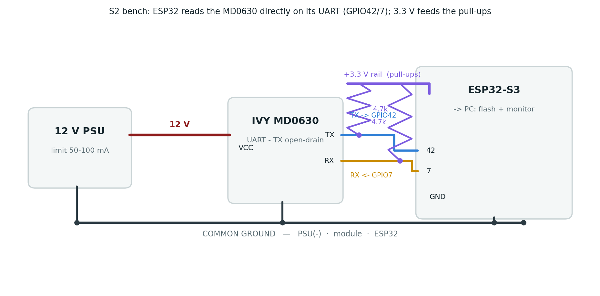
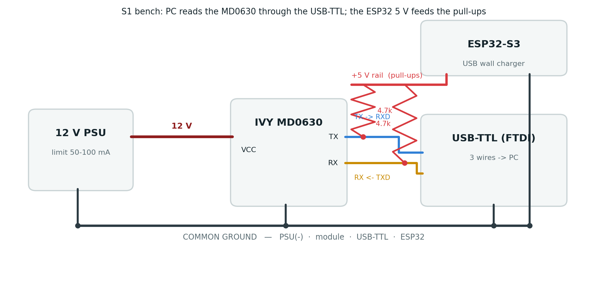

## Objective

Sprint **S3**: write the module's **life-safety thresholds** — DC **6 mA** (`0x0002`), AC **30 mA**
(`0x0003`) — over Modbus at commissioning time, **always confirmed by a read-back**, and never from the
poll loop.

**Result: S3 is complete.** Writes work via Modbus **FC 0x10** (write multiple registers) with
read-back, verified on the ESP32. The register defaults match the datasheet (DC 6, AC 30 mA).

## How S3 was solved (two phases)

1. **Attempt the write from the ESP32** (Wiring A). An **FC 0x06** (write single) was *accepted* by the
   module (no exception) but **silently ignored** — the register never changed. The read-back safety
   caught it (wrote 27 mA → read back 30 mA → rejected).
2. **Sniff IVY's `CT.exe`** doing a "Set" over the USB-TTL (Wiring B). CT.exe writes with **FC 0x10
   (write multiple)** and **no unlock**. The driver was switched to FC16 and re-confirmed on the ESP32.

> There was **no "unlock"** — the blocker was simply the **function code**. Some Modbus devices only
> accept write-multiple (0x10), not write-single (0x06); the MD0630 is one of them.

## Wiring A — ESP32 (the write path)

The MD0630 speaks plain UART, so it connects **directly** to the ESP32 (GPIO42/7); pull-ups to
**3.3 V** (the ESP32-S3 GPIOs are not 5 V tolerant). This is where the driver writes and reads back.

{#fig-a width=100%}

## Wiring B — USB-TTL (to sniff CT.exe)

To learn how the vendor tool writes, the module is placed on the **PC via the USB-TTL**; pull-ups to
**5 V** (the FTDI inputs are 5 V-safe), sourced from the ESP32 5 V pin, with a shared common ground.
`CT.exe`'s own "Communication information" log shows every frame — no external sniffer needed.

{#fig-b width=100%}

## Write flow (`writeThreshold_mA`)

| Step | Action |
|------|--------|
| 1 | `setTransmitBuffer(0, mA × 10)` — e.g. 30 mA → 300 = `0x012C` |
| 2 | `writeMultipleRegisters(reg, 1)` — **FC 0x10** to `0x0002` (DC) or `0x0003` (AC) |
| 3 | 40 ms settle, then **read back** the same register (FC 0x03) |
| 4 | **Confirm**: read-back == written → OK (`ku8MBSuccess`); else **REJECT** (`0xE4`) |

: The write is never trusted without a matching read-back. {#tbl-flow}

## Key finding — FC16, not FC06 (evidence from CT.exe)

```text
Write : 00 10 00 03 00 01 02 01 0E 2B A7   <- FC 0x10, reg 0x0003, qty 1, value 0x010E = 270 = 27.0 mA
Read  : 00 10 00 03 00 01 F0 18            <- success; NO unlock frame anywhere
```

The MD0630 **silently ignores FC 0x06** (write single) and **requires FC 0x10** (write multiple).

## Evidence — on-device confirmation (ESP32)

```text
S3 TEST: AC threshold before=30.0 mA, wrote 27.0 -> after=27.0 mA => write APPLIED
MD0630 AC threshold set to 27.0 mA (reg 0x0003 = 270) - read-back OK
MD0630: applying life-safety threshold defaults (DC 6 mA / AC 30 mA)
MD0630 DC threshold set to 6.0 mA  (reg 0x0002 = 60)  - read-back OK
MD0630 AC threshold set to 30.0 mA (reg 0x0003 = 300) - read-back OK
```

The ESP32 changed AC 30 → 27 mA (read-back confirms), then restored the life-safety defaults. A direct
bus check also swept AC **30 → 4 → 30 mA** with matching read-backs; the module is left at the safe
factory **6 / 30 mA**.

## Safety (per Glenn)

- **Config time only** — never write from the poll loop.
- **Always read-back**, and **reject on mismatch** (`0xE4`).
- Writes target **only** the two confirmed threshold registers (`0x0002` / `0x0003`).
- Life-safety defaults DC **6 mA** / AC **30 mA** (reverse-power-flow → AC 27 mA is S6).
- **Never** click CT.exe's **Calibration** button (factory-only).

## Status & next steps

- **S3 SOLVED** — threshold writes via FC 0x10 + read-back, confirmed on the ESP32.
- The `unlock_*` hooks remain in the driver but are **unused** (no unlock exists).
- **Next: S5** — Leakage Insights Manager + MQTT LV-feeder isolation (design + demo already delivered);
  **S6** — hardware alarm-line GPIO + reverse-power-flow threshold.

---

*Repository:* `docs/leakage_MD0630TA1A/` — details in `S3_threshold_write_procedure.md`; code in
`include/metering/modbus_md0630.h` + `src/metering/modbus_md0630.cpp`. Companion to `S1_report.pdf`,
`S2_report.pdf`, `S4_report.pdf`; the per-sprint reports combine into the full technical document.
