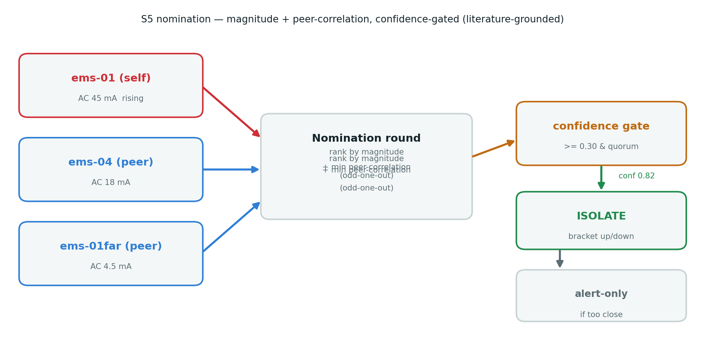

## Objective

Sprint **S5**: implement the **Leakage Insights Manager** and the **multi-EMS nomination** that
isolates a leak on a shared LV feeder, grounded in the literature (`S5_literature_findings.md`), and
prove it end to end — including **live leakage telemetry over MQTT** on a real network.

**Result: S5 is complete.** The manager + nomination run on the ESP32; the leakage streams over MQTT
to a broker on the PC, fault flagged, and is **charted live**.

## Design — nomination (magnitude + peer-correlation)

Each EMS publishes leakage telemetry; the round ranks candidates by **magnitude** *and* by the
**"odd one out"** (the node whose ramp signature correlates least with its peers), then a **confidence
gate** decides auto-isolate (bracket upstream+downstream) vs alert-only.

{#fig-nom width=100%}

## Implementation

`include/metering/leakage_insights_manager.h` + `.cpp`:

- **`LeakageInsightsManager`** — per-EMS state machine (`normal → watch → isolating → fault →
  restored`), telemetry, onset + ramp, and a ramp **signature** for correlation.
- **`nominate()`** — same phase + **correlated onset** → rank by magnitude → **min-peer-correlation**
  odd-one-out → **confidence** (boosted when magnitude leader == min-correlation node, de-rated under
  reverse power flow) → **isolate** (`≥ 0.30` + quorum) or **alert-only**.
- **`selfTelemetry / roundJson / alertJson`** — the three MQTT payloads.

## Evidence A — 3-EMS nomination (bench mock)

This EMS (mock ramp) + two simulated peers (mid ≈ 0.4×, far ≈ 0.1×):

```json
S5 isolation: {"nominated_ems":"street-ems-01","rule":"max_ac_mA + min_peer_corr, correlated_onset",
               "confidence":0.82,"action":"isolate_takeoff (bracket upstream+downstream)",
               "reason":"mag+corr agree","quorum":{"reporting":3}}
```

The nominated node is both the magnitude leader **and** the min-correlation (odd-one-out) node →
`mag+corr agree` → confidence **0.82** → isolate. The full round runs on **one ESP32**.

## Evidence B — MQTT over the real network

The ESP32 connects to WiFi (a phone hotspot) and to **Mosquitto on the PC**; the PC subscriber
receives the leakage, fault included:

```json
openami/StreetEMS_<id>/subpanel_RCMleaks
  {"acSinusoidal":{"value_mA":30.66,"threshold_mA":30,"inFault":true},
   "dc":{"value_mA":6.13,"threshold_mA":6,"inFault":true}, ...}
```

(A **WPA3 / PMF** hotspot blocked the ESP32's older WiFi stack; a **WPA2** hotspot connected instantly.)

## Evidence C — live charts (MQTT Explorer)

Plain-number topics `rcm_ac_mA` / `rcm_dc_mA` are published so any dashboard can chart the leakage.
The mock ramp is visible **rising then holding** at the ceiling (AC → 45 mA, DC → 9 mA):

{#fig-ac width=95%}

{#fig-dc width=95%}

## Literature grounding (see `S5_literature_findings.md`)

- **Nomination by min-correlation** ("odd one out"), not raw amplitude — robust to EMS at different
  feeder positions (from the faulty-feeder-ID method, read in full).
- **Direction** by the residual-voltage / residual-current phase angle **|∠V_res − ∠I_res − 90°|** —
  the reserved `phase_angle_deg` field / IVY-upgrade path.
- **Bracketed isolation** (both sides) + auto-vs-operator mode — from FLISR practice.
- **Change-based** trigger (not absolute level).

## Status & next

- **S5 complete** — insights + nomination (literature-grounded), proven on-device; leakage telemetry
  live over MQTT with fault flag and live charts.
- Production polish: publish the S5 telemetry/isolation/alert on the shared `lvfeeder/…` topics and
  subscribe to **real peers** (replace the simulated ones).
- **Next: S6** — hardware alarm-line GPIO + reverse-power-flow threshold (27 mA).

---

*Repository:* `docs/leakage_MD0630TA1A/` — details in `S5_implementation.md`, `S5_literature_findings.md`,
and the interactive demo `S5_isolation_demo.html`. Companion to `S1`–`S4` reports; together they form
the full technical document.
