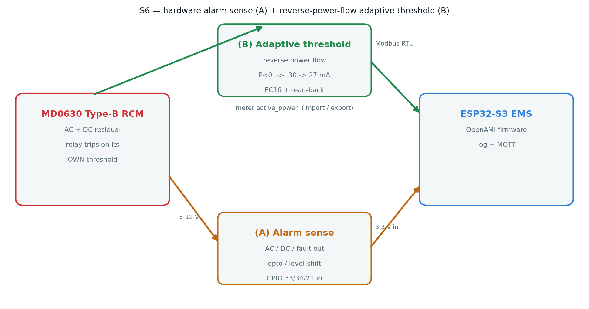

## Objective

Sprint **S6** closes the loop between the MD0630 and the EMS in two directions:

- **(A) Hardware alarm sense** — the module trips on its **own** internal relay when leakage
  crosses a threshold (the life-safety path, independent of firmware). S6-A lets the EMS
  **observe** those alarm output lines on ESP32 GPIO so a trip is logged and published — the
  firmware never drives the trip.
- **(B) Reverse-power-flow adaptive threshold** — when the site **exports** (P < 0), the AC
  leakage limit is tightened **30 → 27 mA** via a debounced, transition-only FC16 write, and
  restored to 30 mA on return to import.

Both paths reuse the confirmed register map (S1), the live read (S2), the FC16 write-with-read-back
(S3), and feed the reverse-flow flag into the S5 nomination confidence de-rate.

{#fig-arch width=100%}

## (B) Reverse-power-flow adaptive threshold

**Rationale.** Under export (PV / battery back-feed) the residual-current signature and the
acceptable leakage budget change; a slightly tighter AC limit (27 mA) protects the export path
without nuisance-tripping normal import operation.

**Detection.** Export is read from the meter's active power: `readings[0].active_power < -0.05f`
(< −50 W). A build flag `-DLEAKAGE_REVERSE_FLOW_DEMO` substitutes a 20 s toggle so the write path
can be exercised with no back-feed on the bench.

**Write discipline (protects the module's store).** The threshold is written **only on a debounced
transition** (3 consecutive poll cycles in the new state), never every cycle — same FC16 +
read-back path proven in S3:

```cpp
static void update_reverse_flow_threshold(bool exporting_now, uint32_t now) {
    if (exporting_now == rf_exporting) { rf_streak = 0; return; }
    if (++rf_streak < 3) return;                 // debounce 3 poll cycles
    rf_streak = 0;
    rf_exporting = exporting_now;
    float target = rf_exporting ? Modbus_MD0630::AC_THRESHOLD_EXPORT_MA   // 27 mA
                                : Modbus_MD0630::AC_THRESHOLD_MA;         // 30 mA
    md0630.writeThreshold_mA(Modbus_MD0630::CH_AC, target);              // FC16 + read-back
}
```

The live export flag is also passed into `leakageInsights5.updateSelf(..., exporting_now, now)` so
S5 `nominate()` de-rates confidence under reverse flow (a leak looks different when exporting).

**Expected serial on transition** (demo flag, 20 s toggle):

```
S6: reverse power flow EXPORT -> writing AC threshold 27 mA
S6: reverse power flow import -> writing AC threshold 30 mA
```

## (A) Hardware alarm sense (read-only)

`include/metering/leakage_alarm_sense.h` — a lightweight `LeakageAlarmSense` that samples the
module's **AC / DC / fault** alarm outputs and reports **only on an edge**:

```cpp
bool poll() {                       // true if any line changed since last poll
    bool changed = false;
    for (auto& l : lines_) {
        l.active = read_active(l.pin);              // active-high (measured on the MD0630)
        if (l.active != l.last) { l.last = l.active; changed = true; }
    }
    return changed;
}
```

Serviced by `service_leakage_alarms()`, called **every `loop()` iteration** (~50 Hz), decoupled
from the slow Modbus poll:

```cpp
if (leakageAlarms.poll())
    Serial.printf("S6 ALARM edge: AC=%d DC=%d FAULT=%d\n",
                  leakageAlarms.ac(), leakageAlarms.dc(), leakageAlarms.fault());
```

**Wiring (safety, no multimeter needed).** The module's alarm outputs are 5–12 V; ESP32 GPIO are
**not** 5 V-tolerant, so each output goes through **one 4.7 kΩ resistor in series** into the GPIO. A
series resistor is safe for *any* output type: a push-pull 5 V high is clamped by the GPIO's internal
ESD diode with the resistor limiting the injected current to ~0.36 mA. Use the module's **5 V header**
outputs, share **GND**, and rely on the **internal** pull (no 3V3/5V rail wired). Pins on the bare
**ESP32-S3-DevKitC-1**: **GPIO 39 (AO/AC), 40 (DO/DC), 21 (AD/fault)** — free, non-strapping header
pins (GPIO 33/34 are not broken out on the devkit; remap on a custom PCB). **Polarity was measured on
the bench**: the MD0630 drives AO/DO **LOW at rest, HIGH on alarm** → **active-high**
(`INPUT_PULLDOWN`; an unwired line reads inactive). This path is **sense-only**: it observes the
module's own trip, it does not command it.

## Validation

| Build configuration | Result |
|---|---|
| Default (both S6 flags off) | **SUCCESS** — RAM 18.8 %, Flash 27.6 % |
| `-DLEAKAGE_ALARM_SENSE -DLEAKAGE_REVERSE_FLOW_DEMO -DLEAKAGE_S5_DEMO` | **SUCCESS** — RAM 18.8 %, Flash 27.9 % |

: Firmware builds clean with S6 disabled (no regression) and with every S6 path compiled in.

**On-device (S6-A, flashed to the ESP32-S3-DevKitC-1, module powered, AO→GPIO39 / DO→GPIO40 via
4.7 kΩ, GND common).** The boot log confirms the sense path and — importantly — the polarity was
found and fixed on the bench:

```text
SETUP: MODBUS: MD0630 alarm sense on GPIO 39/40/21 (AC/DC/fault, active-high)
S6 ALARM edge: AC=0 DC=0 FAULT=0          # at rest, no leakage — quiet (after fix)
```

The first flash (assuming active-low) falsely reported `AC=1 DC=1` at rest; reading the real level
showed the outputs sit **LOW at rest**, so the driver was switched to **active-high** and the rest
state is now correctly quiet. FAULT stays 0 (AD unwired, held inactive by the internal pull-down).

Driving the **AO line high** (3V3 pulse on GPIO39, standing in for a real trip) is logged **live**,
each edge caught in < 200 ms — `DC`/`FAULT` correctly stay 0:

```text
S6 ALARM edge: AC=1 DC=0 FAULT=0          # AO asserted
S6 ALARM edge: AC=0 DC=0 FAULT=0          # AO released
S6 ALARM edge: AC=1 DC=0 FAULT=0
S6 ALARM edge: AC=0 DC=0 FAULT=0
```

To make this reliable, the alarm lines are sampled by `service_leakage_alarms()` at **~50 Hz in the
main loop** — decoupled from the ~seconds-long Modbus poll — so a trip is logged within ~20 ms
instead of up to a poll period late.

**Bench runsheet (module on the ESP32).**

1. Flash with `-DLEAKAGE_REVERSE_FLOW_DEMO` (leave `LEAKAGE_MOCK` off, module connected) → watch
   the AC threshold switch **30 ↔ 27 mA** every ~20 s in the serial log and confirm via a CT.exe
   read-back.
2. **S6-A done:** AO→GPIO39 / DO→GPIO40 via 4.7 kΩ series, GND common, `-DLEAKAGE_ALARM_SENSE`
   flashed → rest state verified quiet (above). Remaining: **induce a leak past 30 mA** so the module
   trips its AO/DO output → confirm the `S6 ALARM edge: AC=1 …` line appears live.

## Status & next

- **S6 complete (firmware) + S6-A verified on hardware** — reverse-flow adaptive threshold (B) and
  hardware alarm sense (A) implemented, gated behind build flags, compiling in both the default and
  full-S6 configurations. S6-A was flashed and its polarity fixed from a live bench reading. S6-B
  reuses the S3 write path; S6-A adds a read-only observer.
- **Bench capture remaining** — the reverse-flow 30↔27 mA switch (B) and a live alarm edge under a
  real >30 mA leak (A), to attach as serial screenshots (same as S3 read-back / S5 charts).
- Production polish: publish the alarm-line state and the active AC threshold on the MQTT feed
  alongside `rcm_ac_mA` / `rcm_dc_mA`.

---

*Repository:* `docs/leakage_MD0630TA1A/` — completes the `S1`–`S5` set. Together S1–S6 form the full
technical document: register map → live read → threshold write → energy correlation → nomination →
hardware alarm + adaptive threshold.
