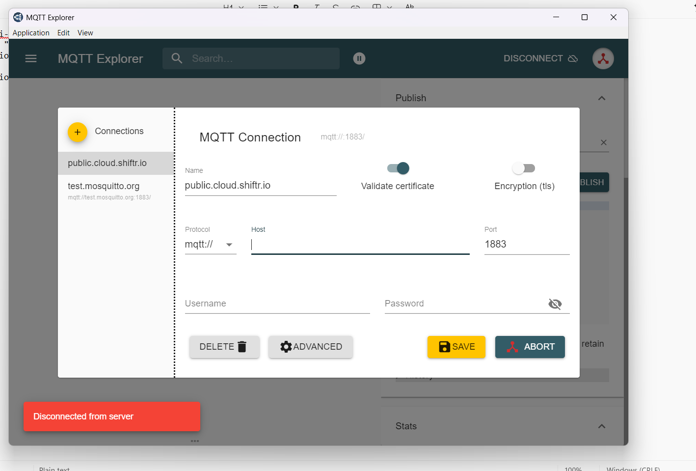
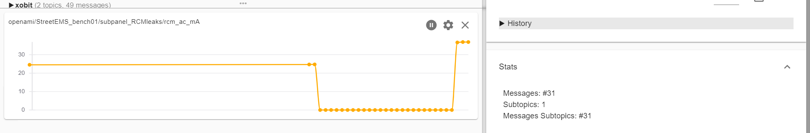
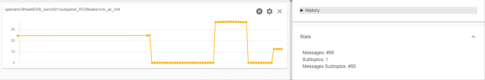
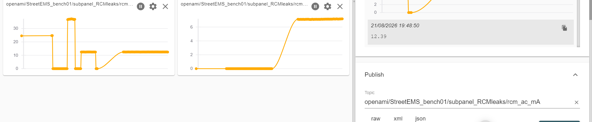
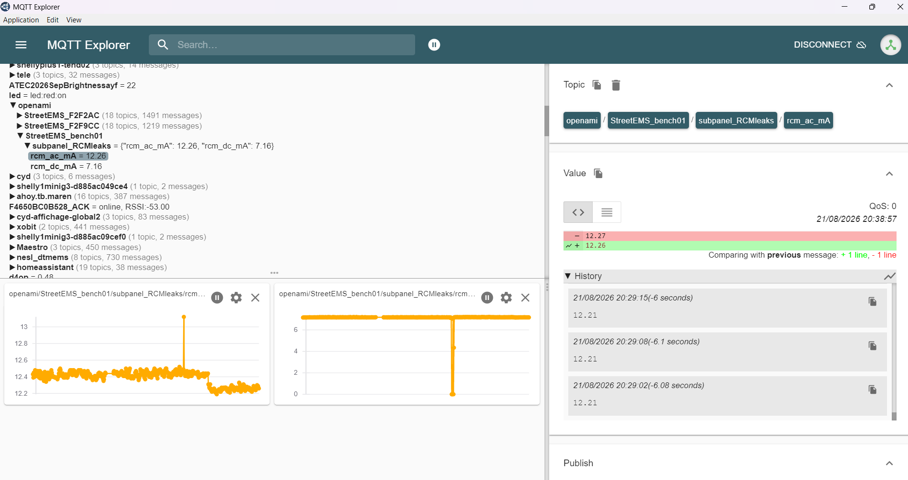
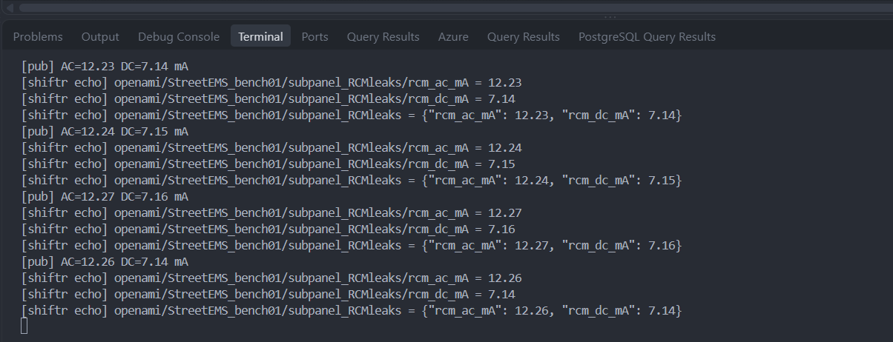

## Objective

Demonstrate that the Street-EMS leakage telemetry (IVY MD0630, S1\textendash S6 firmware) can be
published **live, end to end, to a public cloud MQTT broker** (`public.cloud.shiftr.io`) on the
OpenAMI topic tree, so leakage readings are visible off-site in real time \textendash{} the same
pattern a field deployment would use to reach a remote dashboard.

**Topic:** `openami/StreetEMS_bench01/subpanel_RCMleaks` publishing `rcm_ac_mA` and `rcm_dc_mA` as
plain scalars (git commit `eb13cda`), driven by the isolated AC-adapter / turn-count bench rig
used throughout the S1\textendash S6 validation, varied live to double-check sensitivity end to end
through the public broker (not just a single fixed reading).

## Setup

MQTT Explorer connects to the public broker with TLS-validated certificate, default port `1883`,
anonymous access (`public.cloud.shiftr.io`, no credentials required for the demo broker):

{width=85%}

## Live readings

**Method.** The AC leakage loop is the isolated 9 V AC-AC adapter through **N turns** of wire
through the MD0630 CT window (see the AC leakage bench, S1\textendash S6 report). Two things are
varied live, on purpose, while watching the public broker:

- **Deliberately opening the loop** (unwinding the turns) between steps \textendash{} this is an
  **integrity check**: if the reading isn't real induced current, it wouldn't drop cleanly to
  **0.00 mA** on disconnect. Every zero in the charts below is one of these intentional
  disconnects, not a fault or a dropped connection.
- **Changing the number of turns N** through the CT window \textendash{} this re-scales the induced
  current, so each step settles at a different reading (\textasciitilde 12, 24, 36 mA, \ldots). The
  point is to **probe sensitivity across the range**, not to hold one fixed value: seeing the
  reading track N cleanly, and return to exactly 0 every time the loop opens, is the actual proof
  that the sensor \textendash{} not just the MQTT plumbing \textendash{} is working correctly.

With the bench board publishing at its normal poll rate, `rcm_ac_mA` is visible live in MQTT
Explorer's chart: a stable reading at one turn count (\textasciitilde 24.5 mA, already above the
30 mA alarm threshold once one more turn is added), then a clean drop to **0.00 mA** on the
deliberate disconnect:

{width=100%}

Adding a turn pushes the reading **past the 30 mA threshold** \textendash{} the chart below catches
it jumping to **36.83 mA**, back to **0** on the next deliberate disconnect, then settling around
**12 mA** once the turn count is reduced again:

{width=100%}

Continuing the bench run, both channels are exercised together \textendash{} `rcm_ac_mA` settles near
12.4 mA at a given turn count while `rcm_dc_mA` is ramped from 0 to \textasciitilde 7.1 mA on the DC
side, both visible as separate live charts on the same broker session:

{width=100%}

## Gateway proof (serial \textrightarrow{} shiftr.io bridge)

The bench ESP32-S3 ran WiFi-off (radio fault, see project notes) with real MD0630 readings on
serial; `tools/shiftr_gateway.py` bridges that serial stream to the public broker. The terminal log
confirms each reading is published (`[pub]`) and immediately echoed back by the broker
(`[shiftr echo]`), proving the round trip:

{width=100%}

{width=95%}

## Status & next

- **Demo secured** \textendash{} real MD0630 AC/DC leakage readings reach a public cloud MQTT broker
  live. Varying the turn count and repeatedly opening the loop to force a clean **0.00 mA** confirms
  the readings track the induced current (not MQTT/network artifacts), across a range that includes
  a captured 30 mA AC threshold crossing (36.83 mA).
- **Known caveat** \textendash{} the bench ESP32-S3's WiFi radio is currently damaged (boot-loops on
  `WiFi.mode(WIFI_STA)`), so this run used the PC-side `shiftr_gateway.py` bridge instead of the
  board's own onboard WiFi/MQTT client. The MQTT payload and topic tree are otherwise identical to
  what the board publishes directly once WiFi is restored (or over Ethernet, already implemented in
  `src/comms/ethernet.cpp`).
- **Next:** repeat with the board's native WiFi/Ethernet MQTT client (no PC gateway) once a working
  radio or Ethernet path is confirmed, then record the rehearsed 5-minute video + Q&A for the
  workshop deliverable.

---

*Repository:* `docs/leakage_MD0630TA1A/` \textendash{} companion evidence to the S1\textendash S6
technical report; source screenshots in `docs/screenshot/` (2026-08-21 bench session).
